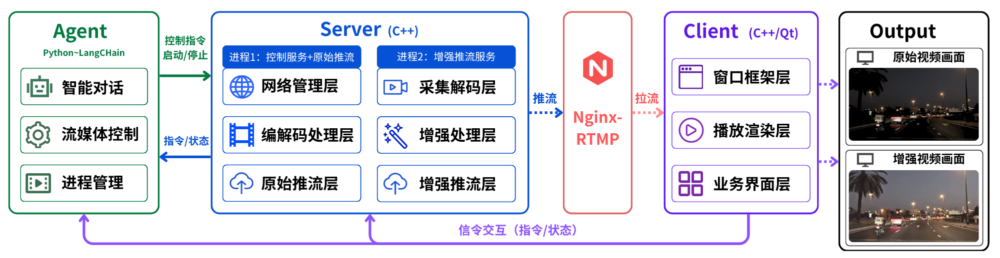

# NightLight Website

NightLight 项目官方网站。

**在线访问**: [https://breaker505.github.io/NightLight-Website/](https://breaker505.github.io/NightLight-Website/)



## 技术栈

| 技术 | 用途 |
|------|------|
| HTML5 | 页面结构 |
| CSS3 | 样式和响应式布局 |
| JavaScript | 交互逻辑（导航、滚动动画） |

## 页面内容

- **Hero** — 产品名称、核心定位、技术栈标签
- **为什么需要 NightLight** — 4 个痛点 + 4 个解决方案
- **核心能力** — AI 增强、LLM Agent、RTMP 推流、跨平台客户端、Docker 部署、模块化架构
- **系统架构** — 三进程协作图 + 组件职责表
- **效果演示** — 低光增强对比视频
- **快速上手** — Docker / 手动构建命令

## 本地预览

```bash
cd NightLight-Website
python -m http.server 8080
# 访问 http://localhost:8080
```

## 相关仓库

- [NightLight](https://github.com/breaker505/NightLight) — 主项目（C++17 + Qt + FFmpeg + ONNX + LLM Agent）
